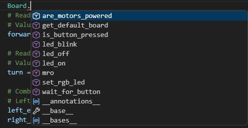
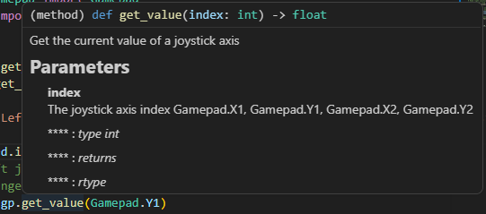
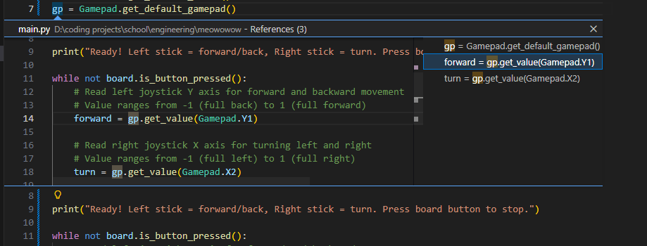
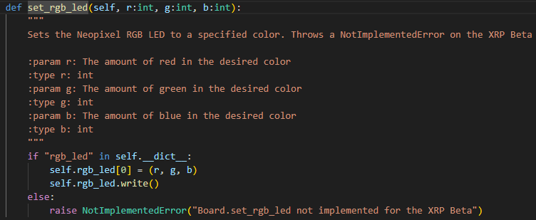

# miauw
hello. this is something i made forrrrrr engineering and whatever. it's just a template project you can use to have nice intellisense suggestions for our xrp robot circuit board things. i'm not going to share this directly with the other class periods because it's a competition and stuff, butttt it's not like i can stop you.

what is intellisense? well. it's. wonderful.

when you type `.` a little window pops up with suggestions

have a look

`.` operator suggestions, so you can get a built-in list of what something can do for you:

hovering your mouse over things explains them to you:

control + click on anything to see where it goes:

and where it comes from:

(though for our situation specifically it's not as useful as is normal)

# miauw?
using vscode, clone this repository, add the recommended extensions (i put them there purposefully), write your code with the nice syntax highlighting and intellisense you now have available to you

then when you wanna upload it to the robot, just select all and copypaste your code into the normal web editor

yes, trust the extension people. i guess. they all have a gazillion downloads, it's whatever

# miauw???
links collection
- vscode download https://code.visualstudio.com/download it's a microsoft product don't worry
- github repository clone tutorial https://code.visualstudio.com/docs/sourcecontrol/repos-remotes#_clone-repositories it's easier than you think
  1. have or create a github account
  2. sign into vscode
  3. copy this link (don't go to it, just copy) https://github.com/robotemployee/meowowow.git
  4. in vscode on the top left, click file > New Window
  5. in the Welcome page it shows you, under Start, click "Clone Git Repository"
  6. paste.
  7. the rest doesn't really matter.
- git link for this repo https://github.com/robotemployee/meowowow.git

### git advertisement
also, if you don't already use git, you should. you won't be able to directly modify my online repository (the one you just cloned to your local computer), but you can "commit" (save) whatever you want to your computer's local repository. git is a wonderful thing. it's like turbo undo, or like google docs edit history on steroids. truly a lifesaver

# miauouw.
### it might complain a little too much
i tried to turn off all of the annoying things the linter (thing that tells you when something looks funny, makes things look pretty with all the colors) would warn you about, like the order you put your import statements in. i didn't get all of them. if you get like, a blue or yellow squiggly line warning thing and it's just... annoying and asinine, let me know with a picture of the little hover message it gives you and i'll add it to the list

### you can only see stubs
stuff under `machine` only has stubs available. this means that you can't actually see *how* the code is implemented - you can only see the names, parameters, and return types of functions. thankfully, all of them have explainations from the developer people on what they're meant to do. so just read those.